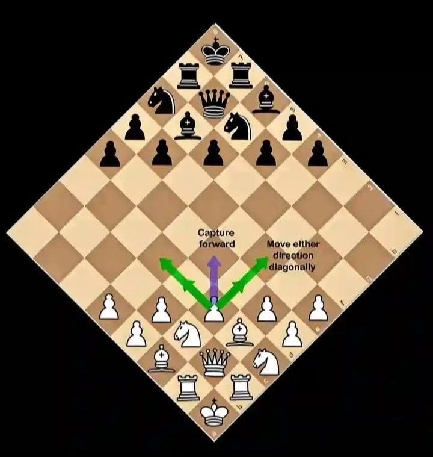

# Diamond Chess ♦️

A unique chess variant played on a 45° rotated diamond board with modified pawn mechanics. Built with Next.js 14, TypeScript, and Material-UI.



## 🎮 Game Features

- **Diamond Board**: Standard 8x8 chess board rotated 45° for unique visual presentation
- **Modified Pawn Rules**: Unique directional movement (White: Left/Up, Black: Right/Down)
- **Real-time Multiplayer**: Live game updates with optimistic UI updates
- **Complete Chess Rules**: Full implementation including check, checkmate, and stalemate detection
- **Beautiful UI**: Material-UI design with subtle animations and visual feedback
- **Match System**: Create matches, share links, and play with friends

## 🚀 Quick Start

### Prerequisites

- Node.js 18+
- PostgreSQL database
- Discord OAuth app (for authentication)

### Installation

1. **Clone the repository**

   ```bash
   git clone <repository-url>
   cd diamond
   ```

2. **Install dependencies**

   ```bash
   yarn install
   ```

3. **Set up environment variables**

   ```bash
   cp environment.example .env.local
   # Edit .env.local with your database and Discord OAuth credentials
   ```

4. **Set up the database**

   ```bash
   yarn prisma generate
   yarn prisma db push
   yarn prisma db seed
   ```

5. **Start the development server**

   ```bash
   yarn dev
   ```

6. **Open your browser**
   Navigate to `http://localhost:3000`

## 🎯 How to Play

### Diamond Chess Rules

**Board Layout:**

- Standard chess board rotated 45° into diamond shape
- 24 pieces total (12 per player) in symmetric formation
- White king starts at bottom center, Black king at top center

**Piece Movement:**

- **Pawns** (Modified):
  - White: Move Left OR Up, capture diagonally Top-Left only
  - Black: Move Right OR Down, capture diagonally Bottom-Right only
- **All Other Pieces**: Follow standard chess movement rules

**Winning:**

- Checkmate your opponent's king
- Stalemate results in a draw

### Playing Online

1. **Sign in** with Discord
2. **Create a match** from the homepage
3. **Share the match link** with a friend
4. **Play in real-time** with live updates

## 🏗️ Technical Architecture

### Tech Stack

- **Frontend**: Next.js 14 (App Router), React 18, TypeScript
- **UI**: Material-UI v5 with custom chess theme
- **Authentication**: NextAuth.js v5 with Discord OAuth
- **Database**: PostgreSQL with Prisma ORM
- **Real-time**: SWR polling with optimistic updates
- **Deployment**: Vercel (recommended)

### Key Design Decisions

**Dual Coordinate System:**

- Game logic uses standard chess coordinates (file: 0-7, rank: 0-7)
- UI applies 45° transformation for diamond visual display
- This keeps chess rules simple while allowing unique presentation

**Server-First Architecture:**

- All game validation happens server-side via Next.js Server Actions
- Client uses SWR for real-time state synchronization
- Optimistic updates provide smooth UX

## 📁 Project Structure

```
src/
├── app/                    # Next.js App Router pages
│   ├── match/[id]/        # Live game interface
│   └── test-diamond/      # Development testing page
├── components/game/        # Game UI components
│   ├── DiamondBoard.tsx   # Main board component
│   ├── PlayerCard.tsx     # Player info & status
│   └── MoveHistory.tsx    # Move tracking
├── lib/
│   ├── actions/           # Server Actions
│   │   └── gameActions.ts # Match & game operations
│   └── game/              # Core game logic
│       ├── coordinates.ts # Coordinate transformations
│       ├── pieceMovement.ts # Piece movement rules
│       ├── moveValidation.ts # Move & game validation
│       └── boardSetup.ts  # Initial board state
├── hooks/                 # React hooks
│   └── useGame.ts         # SWR game state hooks
└── types/game.ts          # TypeScript definitions
```

## 🧪 Development

### Testing the Game

Visit `/test-diamond` for development testing:

- Visual board state debugging
- Move calculation testing
- Coordinate transformation validation

### Key Files to Understand

1. **`src/lib/game/coordinates.ts`** - Coordinate system and transformations
2. **`src/lib/game/pieceMovement.ts`** - All piece movement rules
3. **`src/lib/actions/gameActions.ts`** - Server-side game operations
4. **`src/components/game/DiamondBoard.tsx`** - Main UI component

### Development Commands

```bash
# Start development server
yarn dev

# Database operations
yarn prisma generate     # Generate Prisma client
yarn prisma db push      # Push schema changes
yarn prisma studio       # Open database GUI

# Build for production
yarn build
yarn start
```

## 🎨 Customization

### Modifying Game Rules

1. **Piece Movement**: Edit `src/lib/game/pieceMovement.ts`
2. **Board Setup**: Modify `src/lib/game/boardSetup.ts`
3. **Validation**: Update `src/lib/game/moveValidation.ts`
4. **Test Changes**: Use `/test-diamond` page

### UI Customization

- **Theme**: Edit `src/lib/theme.ts` for colors and styling
- **Board**: Modify `src/components/game/DiamondBoard.tsx`
- **Layout**: Update `src/components/layout/MainLayout.tsx`

## 📚 Documentation

- **Game Rules & Architecture**: See `docs/reference_game_rules.md`
- **Project Plan**: See `docs/plan_project_setup.md`
- **Setup Guide**: See `SETUP.md`

## 🚀 Deployment

### Vercel (Recommended)

1. **Connect your repository** to Vercel
2. **Set environment variables** in Vercel dashboard
3. **Deploy** - Vercel will automatically build and deploy

### Environment Variables

```bash
# Database
DATABASE_URL=postgresql://...

# NextAuth.js
NEXTAUTH_SECRET=your-secret-key
NEXTAUTH_URL=http://localhost:3000

# Discord OAuth
DISCORD_CLIENT_ID=your-discord-client-id
DISCORD_CLIENT_SECRET=your-discord-client-secret
```

## 🤝 Contributing

1. Fork the repository
2. Create a feature branch (`git checkout -b feature/amazing-feature`)
3. Commit your changes (`git commit -m 'Add amazing feature'`)
4. Push to the branch (`git push origin feature/amazing-feature`)
5. Open a Pull Request

## 📝 License

This project is open source and available under the [MIT License](LICENSE).

## 🎮 Play Now!

Ready to experience chess in a whole new way? Create your first Diamond Chess match and challenge a friend!

---

**Diamond Chess** - Where strategy meets innovation ♦️
